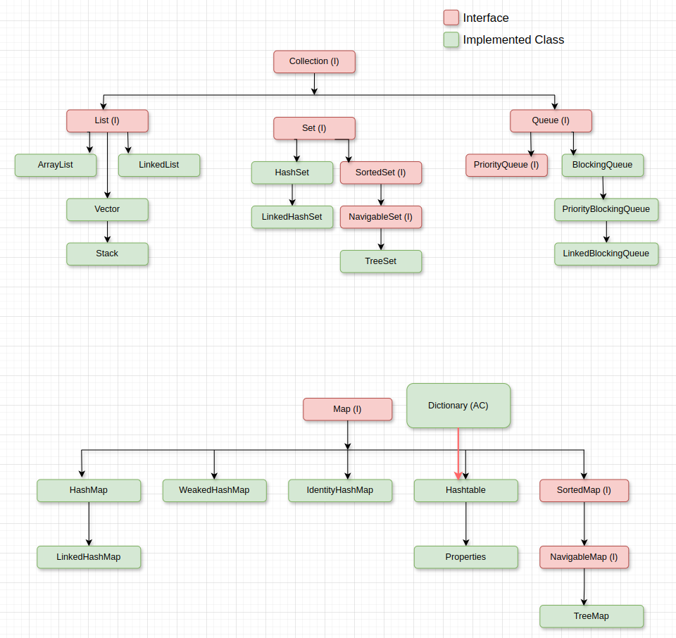
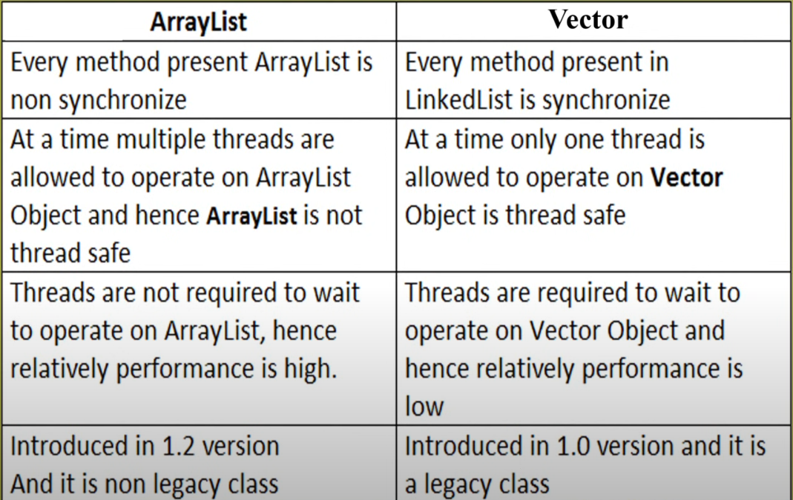

# 01 Location of collection framework : 
`java.util` package.

# 02 Why do we need collection framework ?
To understand the need of collection framework let's first understand the limitations of arrays. Since we already have arrays, why do we need more data structures that collection framework provides.

## Limitation of arrays : 
1. **Fixed Size:** Arrays have a fixed size, which must be determined at the time of creation and cannot be changed later.
2. **Homogeneity:** Arrays are homogeneous in nature, meaning they can store only one type of object. 
3. **Lack of Built-in Methods:** Arrays do not have an underlying data structure. As a result, there are no ready-made methods available for operations like sorting, deletion, or searching. This requires developers to repeatedly implement these functionalities from scratch.
4. **Inefficient Memory Utilization:** Arrays can lead to poor memory utilization. For instance, if an array of 100 elements is created but only 2 elements are initialized at runtime, the remaining 98 positions are wasted.

To overcome these challenges java introduces collection framework. It provides built-in interfaces and methods that allow us to efficiently store and manage individual objects as part of a unified collection. 



# 03 Collection Framework 
Interfaces offered by the collection framework can be divided into two categories :
1. Interfaces that define data structures storing objects in key-value pairs
Example: The `Map` interface.
2. Interfaces that define data structures storing objects in non-key-value pairs
Example: The `Collection` interface. 

## Five key interfaces offered by the collection framework :
1. **Collection Interface :** The `Collection` interface is rarely used directly; instead, its child interfaces are more commonly utilized. The Collection interface provides general-purpose methods that are applicable to any collection object. Example : `add()`, `remove()`, `size()`, `isEmpty()`.

    ##### 1.1 Difference between `Collection` and `Collections` : 
    `Collection` is an interface while `Collections` is an utility class which defines several utility methods for collection objects to use. `Collections` class is also a part of collection framework. 

2. **List :** It is a child interface of `Collection` interface. When we want to store duplicate values along with their insertion order in that case use `List` interface. Implemented classes of `List` interface are `ArrayList`, `LinkedList`, `Vector`
3. **Set :** Again it is a child interface of `Collection` interface. When we want to store non-duplicate value and the order of insertion does not matter in that case use `Set` interface. 
4. **Queue :** It is a child interface of `Collection` interface. It is used when we want to store the data before processing it.
5. **Map :** When we want to store collection object in key value pair in that case we use map interface. 

## Comparable interface : 
When we want the default sorting order i.e sorting order that collection framework offers then use this interface.

## Comparator interface :
But if want to create our own sorting order then use this inteface.

## Cursors :
Suppose we want to extract an object from the collection in that case we need cursors. There are 3 cursors in java :
1. Enumeration interface
2. Iterator interface
3. ListIterator interface


## Utility Classes : 
There are two utility classes in collection framework :
1. Collections
2. Arrays

---

# 1. Collection Interface :
- If we want to represent a group of individual objects as a single quantity in that case we use collection interface.
- Collection Interface defines most common methods which are applicable for any collection object.
- Methods in collection framework : 
```java
boolean add(Object o)
boolean addAll(Collection o)
boolean remove(Object o)
boolean removeAll(Collection o)
void clear()
boolean retainAll(Collection c)     // removes everything except c
boolean isEmpty()
int size()
boolean contains(Object o)
boolean containsAll(Collection c)
Object[] toArray()
Iterator iterator()
```

**Note** : Collection Interface does not contain any methods to reterive objects. 

# 2. List Interface :
- It is a child interface of `Collection` interface. 
- When we want to insert duplicate values and also want to maintain the insertion order then we use `List` interface. 
- In `List` inteface, **index** play an important role. Using **index** we can maintain insertion order as well as differentiate between duplicate values.

```java
ArrayList l = new ArrayList();

l.add("a");
l.add(int index, Object o);         // adding object at specific index.
l.addAll(int index, Collection c)   // adding a group of objects at specific. location
l.remove(int index)                 // remove element from specific index.
l.indexOf("A")                      // returns the index of first occurrence of. "A".
l.lastIndexOf("A")                  // returns the last index of "A".
l.get(int index)                    // returns object present at that index.
l.listIterator()                    // returns object one by one.
l.set(int index, Object o)          // replace element at specific location.
```

## 2.1 ArrayList Class :
- Underlying data structure of `ArrayList` is resizable array.
- Duplicates are allowed and insertion order is preserved.
- Hetrogenous objects are allowed.
    - Hetrogenous objects are allowed in collection framewok except in case of `TreeSet` and `TreeMap`.
- `null` insertion is allowed .

### 2.1.1 ArrayList Constructors :
```java
/* *************** FIRST TYPE OF CONSTRUCTOR ***************
Creates an empty ArrayList object with default initial capacity 10.
Once ArrayList reaches its map capacity a new ArrayList will be created with
new capacity = (currentCapacity * 3/2) + 1.
*/
ArrayList al = new ArrayList()


/* *************** SECOND TYPE OF CONSTRUCTOR ***************
When we want to define an ArrayList with different intial capacity then we use this 
constructor.
*/
ArrayList l = new ArrayList(int newIntialCapacity)


/* *************** THIRD TYPE OF CONSTRUCTOR ***************
When we want to create equivalent ArrayList using collection object in that case
use this constructor.
*/
ArrayList l = new ArrayList(Collection c);
```

**Usually we can use Collections to hold and transfer Objects from one place to another place, to provide support for this requirement every Collection already implements `Serializable` and `Cloneable` interface.**

- To make sure any element can be accessed in same amount of constant time whether it is first element or the last element both ArrayList and Vector class implement `RandomAccess` interface.
    - `RandomAccess` interface is present inside `java.util` package. It does not contain any methods hence it is a **Marker** interface.
- If our frequent operation is retrieval of data then ArrayList is the best choice since it implements RandomAccess interface. 
- If our frequent operation is insertion or removal of objects from the middle then ArryaList is the worst choice since it requires several shifting operation.  

### 2.1.2 Difference between ArrayList and Vectors 

- ArrayList size grows as: (currentSize * 3/2) + 1 while Vectors size doubles.

### 2.1.3 How to get synchronized version of ArrayList object :
```java
ArrayList l = new ArrayList();

List newList = Collections.synchronized(l);
```

## 2.2 LinkedList Class :
- Underlying data structure for LinkedList is doubly linked list.
- Insertion order is preserved and duplicates are allowed.
- Hertogenous elements are allowed.
- `null` insertion is possible.
- LinkedList implements `Serializable` interface and `Clonable` interface but not `RandomAccess` interface.
- If insertion and deletion of data from the middle is our ultimate requirement then going for the `LinkedList` is our best option.
- `LinkedList` is the worst choice if we want to retrieve an element because our program has to iterate over each element to get to the desired element becuase previous element stores the memory location of the next element.
- Using array we can implement stack and queue very easily but same can be done using `LinkedList` although it can be quite challenging. To ease out our pain LinkedList class provides 6 methods which we can use during stack and queue implementation.  
```java
void addFirst(Object o)
void addLast(Object o)
Object getFirst()
Object getLast()
Object removeFirst()
Object removeLast()
```

### 2.2.1 LinkedList Constructors :
```java
// creates empty linked list object.
LinkedList l = new LinkedList();

// creates an equivalent linked list object for the given collection.
LinkedList = new LinkedList(Collection c);
``` 

### 2.2.2 Difference between ArrayList and LinkedList


## 2.3 Vectors
- Underlying data structure is growable arrays.
- Duplicates are allowed and insertion order is maintained.
- Hetrogenous objects are allowed.
- `null` insertion is allowed.
- Vectors implements `Serializable`, `Clonable` and `RandomAccess` interface.
- All methods of vectors are synchronous hence they are thread safe.
- Best choice if the frequesnt operation is retrieval.

```java
// these are some vector specific methods
int size()
int capacity()
Object elementA(int index)
Object firstElement()
Object lastElement()
removeElement()
removeElementAt()
removeAllElement()
addElement()

/*
If we don't want to use these vectors specific methods we can also use equivalent
methods provided by the List and Collection interface.
For example: 
add()
remove()
set()
.
.
.
etc.
*/
```

### 2.3.1 Vector Constructor
```java
// creates vector object with 10 initial capacity
// capacity of newly created vector when current vector gets filled is twice the size of current vector.
Vector v = new Vector();


// creates empty vector object with specified initial capacity
Vector v = new Vector(int newInitialCapacity);


// if we dont want the new vector to double every time current vector get filled 
// then we can define our own inceremental value. 
Vector v = new Vector(int initialCapacity, int incrementalCapacity);


// creates equivalent vector object for the given collection
Vector v = new Vector(Collection c);
```

