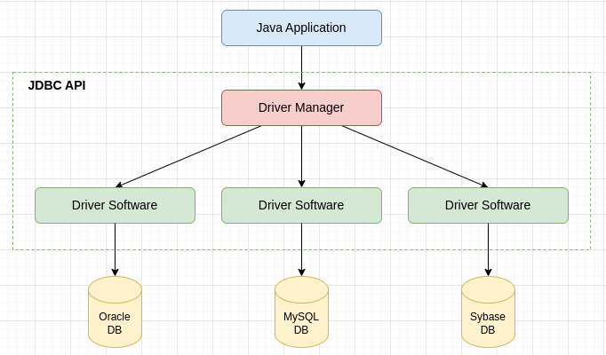
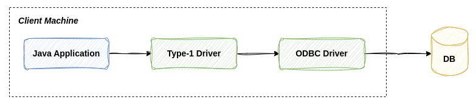
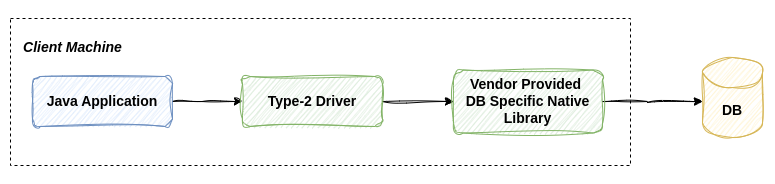
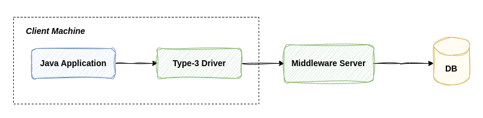
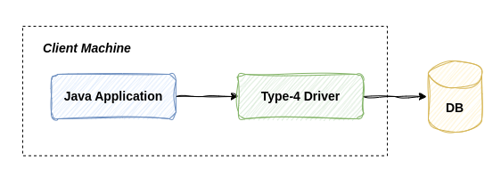

# What is JDBC ?
- It is standard Java Api.
- It is used when we want to connect a Java Application with a Database.
- It is a part of Java Standard Edition.
    - Java comes in 3 different editions : 
        1. **Java Standard Edition**: It contains core Java and JDBC. 
        2. **Java Enterprise Edition**: It contains JSPs and servlets.
        3. **Java Micor Edition**: Used for mobile application development. 
- It is database independent i.e we can use same piece of code to connect with Oracle DB, Sql or anything else.

# Components of JDBC
1. **Driver Software** : Translate Java Application query into a format that the database understands and converts the database responses back into Java-readable format. 
2. **Connection** :  Establishes a link between the Java application and the database, allowing communication between them.
3. **Statement Object** : It takes Java Application query to the DB and bring back the response generated by the DB.
4. **Result Set** : The response that DB sent back to the Java Application is present inside the ResultSet.

# JDBC Architecture 

- Java Application communicates with Driver Manager which is provided by the JDBC Api. 
- Location of JDBC Api: `java.sql` and `javax.sql` package.
- Features of Driver Manger : 
    - It manages all the driver software.
    - It is responsible for register and unregister driver software.
    - It is responsible for establishing the connection between database and java application.

- JDBC Api provides classes and interfaces which developers and driver software vendors can use.  
- Implementation of Interface present inside the JDBC Api is provided by the driver software vendor. The implemented classes are called as Driver Software. 
- Driver Software are present in the form of JAR files. It can be provided by either Java or Database Vendor or some third party.

# Types of JDBC Driver
1. Type-1 also known as bridge drivers.
2. Type-2 also known as native drivers.
3. Type-3 also known as middleware drivers.
4. Type-4 alos known as pure java drivers or thin drivers.

# Type-1 Driver

- As we can observe from the above figure Type-1 driver is not directly communicating with the Database instead it is communicating with the ODBC driver. 
- **Advantage** :
    - We don't need to install this driver separately as it comes with JDK itself.
    - This driver is Database independent because ODBC driver is the one who's communicating with the Database not the Type-1 driver.
- **Limitations** :
    - It is slowest driver becuase it requires multiple conversion. i.e `JavaApplication ----> ODBC ----> DB`.
    - Internally, the Type-1 driver uses ODBC, which is only compatible with Windows machines. Therefore, Type-1 drivers can only be used on Windows, making them platform-dependent.
    - Not supported by java 1.8 onwards.

# Type-2 Driver

- **Advantage** : 
    - Faster than Type-1 driver.
    - Compared to Type-1 drivers, Type-2 drivers are more portable. While they are still platform-dependent, we can choose the vendor-provided, database-specific native library based on the platform we are using, which is not possible with the Type-1 driver.

- **Limitations** : 
    - Type-2 drivers are database and platform dependent drivers.
    - No gaurantee of vendor providing database native library. 
    - These drivers are available for Oracle Database.

**Note**: Type-2 drivers are the only drivers which are platform and database dependent.

# Type-3 Driver

- **Advantage** :
    - Database and Platform independent driver.
- **Limitations** :
    - Relatively performance is low because of two level conversion i.e `JavaApplication ----> MiddleWareServer ----> Database`.
    - Middleware server installation on local machine is required which may increase the cost of operation.

# Type-4 Driver

- **Advantage** :
    - Type-4 driver communicates with Database directly using Database specific native protocols.
    - Platform independent driver.
    - Fast, since only one conversion is required.
- **Limitations** :
    - Database dependent driver.

If we are using only one kind of database in our application then go with Type-4 driver but if we are using multiple databases then go with Type-3 driver. If Type-4 and Type-3 drivers are not availale for a database then go with Type-2 driver. And if none of the above three drivers exists for a database then go with the Type-1 driver.