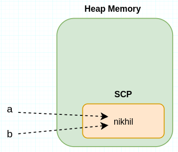
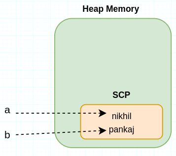
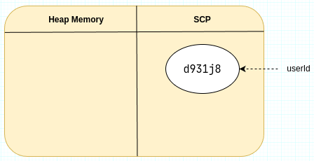
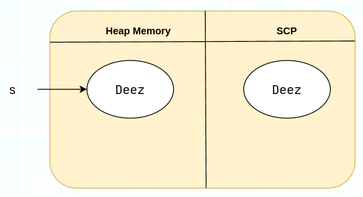

# 01 Difference between String and StringBuffer :
1. `String` is immutable while `StringBuffer` is mutable.
2. `String` override the defult behaviour of `equals()` method while `StringBuffer` don't.

```java
// verifying strings are immutable in java
String name = new String("loco");
name.concat("poco");
System.out.println(name);   // loco
```
```java
// verifying StringBuffer is mutable in java
StringBuffer sb = new StringBuffer("es ");
sb.append("loce es");
System.out.println(sb);     // es loce es
```

# 02 String object creation in Heap memory and String Constant Pool (SCP) :
As a rule of thumb whenever we use `new` keyword, a new object is created in heap memory. SCP is a section of heap memory that stores strings only. If two refernce variables are using same string literal-for example, `String a = "nikhil"` and `String b = "nikhil"`-instead of creating two `"nikhil"` string objects, a single `"nikhil"` string object is created in the SCP. Both referene variable `a` and `b` will then point to this single object.   

When any of the reference variables attempts to change its value, a new string object is created in the SCP. The reference variable then points to this new object.
`b = "pankaj"`


The benefit of this SCP (String Constant Pool) approach is that it allows us to avoid creating duplicate values, which results in better memory management.

## 2.1 Where and how many String objects will be created 
### Case 1:
```java
String userId = "d931j8";
```
String object will be created in SCP and userId reference variable will point to that object.

As we can see only one object is created here. 

### Case 2: 
```java
String s = new String("Deez");
```
Here, two string objects will be created: one in the heap memory (since the new keyword is used) and one in the String Constant Pool (SCP) because a string literal is passed to the constructor. Meanwhile, the reference variable `s` will point to the object present in the heap memory, not the one in the SCP.

Two string objects are created here.