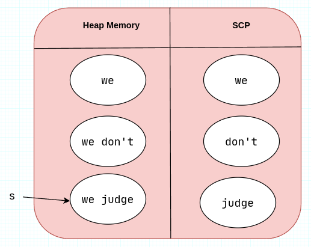

# 01 Difference between String and StringBuffer :
1. `String` is immutable while `StringBuffer` is mutable.
2. `String` override the defult behaviour of `equals()` method while `StringBuffer` don't.

```java
// verifying strings are immutable in java
String name = new String("loco");
name.concat("poco");
System.out.println(name);   // loco
```
```java
// verifying StringBuffer is mutable in java
StringBuffer sb = new StringBuffer("es ");
sb.append("loce es");
System.out.println(sb);     // es loce es
```

# 02 String object creation in Heap memory and String Constant Pool (SCP) :
As a rule of thumb, whenever string creation takes place during **compile time**, the string object will be created in the String Constant Pool (SCP). On the other hand, whenever string creation takes place during **runtime** (or when the `new` keyword is used), the string object will be created in the heap memory.

The SCP is a special section of the heap memory that stores only strings. If two reference variables use the same string literal—for example, `String a = "nikhil"` and `String b = "nikhil"`—instead of creating two separate `"nikhil"` string objects, a single `"nikhil"` string object is created in the SCP. Both reference variables `a` and `b` will then point to this single object.


When any of the reference variables attempts to change its value, a new string object is created in the SCP. The reference variable then points to this new object.
`b = "pankaj"`


The benefit of this SCP (String Constant Pool) approach is that it allows us to avoid creating duplicate values, which results in better memory management.

## 2.1 Where and how many String objects will be created 
### Case 1:
```java
String userId = "d931j8";
```
String creation will takes place during compile time hence string object will be created in SCP and `userId` reference variable will point to that object.


As we can see only one object is created here. 
**Remember for future reference :** String literals are always created in **SCP**.

### Case 2: 
```java
String s = new String("Deez");
```
Here, two string objects will be created: one in the heap memory (since the new keyword is used) and one in the String Constant Pool (SCP) because a string literal is passed to the constructor. Meanwhile, the reference variable `s` will point to the object present in the heap memory, not the one in the SCP.


### Case 3:
```java
String s1 = new String("hawk");
String s2 = new String("hawk");
String s3 = "hawk";
String s4 = "hawk";
```


Three string objects will be created here : two in heap and one in SCP. 

### Case 4:
```java
String s = new String("we");    // "we" will be created in both heap and SCP.
s.concat("don't");              // "we don't" will be created in heap and "don't" in SCP.
s = s.concat("judge");          // "we judge" will be created in heap and "judge" in SCP.
```



### Case 5: 
```java
String s = "hello" + "nikhil";  // "hello nikhil" object will be created in SCP
```
### Case 6:
```java
String msg = "hello";           // "hello" will be created in SCP
String name = msg+"nikhil";     // "nikhil" will be created in SCP and "hello nikhil" will be created in heap.
```

### Case 7: 
```java
final String msg = "hello";     // "hello" will be created in SCP.
String name = msg+"nikhil";     // "hello nikhil" will be created in SCP.
```

# 03 Important String constructors :
```java
String s = new String();    
String s = new String(String str);
String s = new String(StringBuffer sb);     // will created equivalent string object using StringBuffer.
String s = new String(StringBuilder sb);    // will created equivalent string object using StringBuilder.
String s = new String(Char[] ch);        
String s = new String(byte[] b);
```

# 04 StringBuffer :
`StringBuffer` is recommended for use when the content is frequently changing. Since `StringBuffer` is **mutable**, no new object is created when the string changes. Instead, the original object is modified. 

